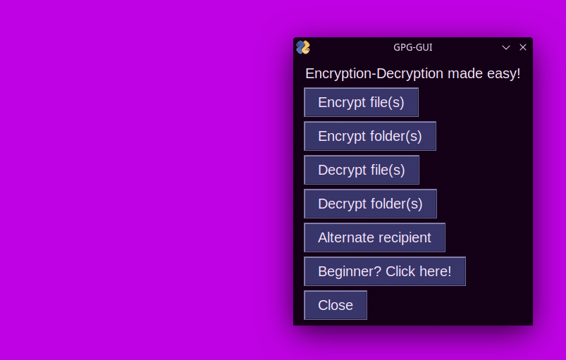
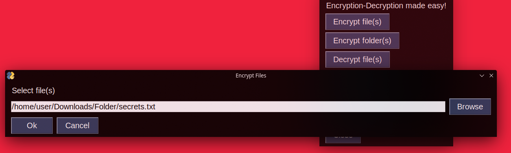
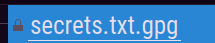
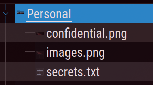
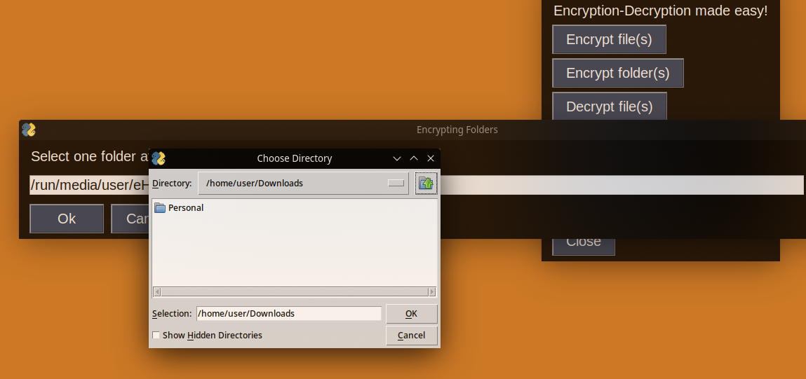
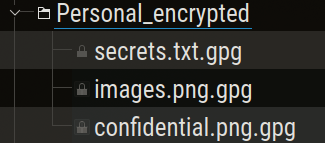
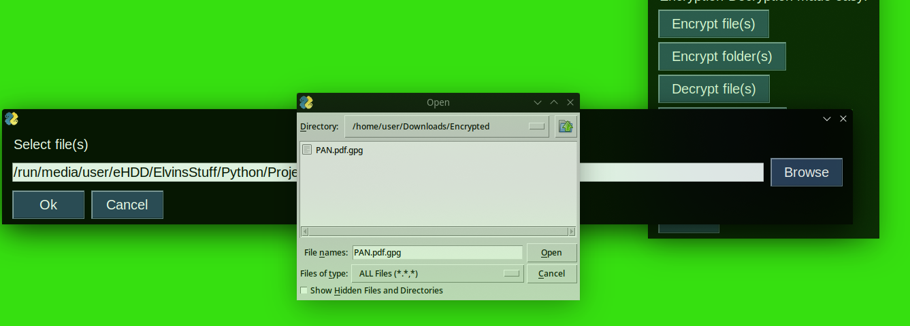
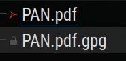
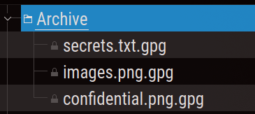
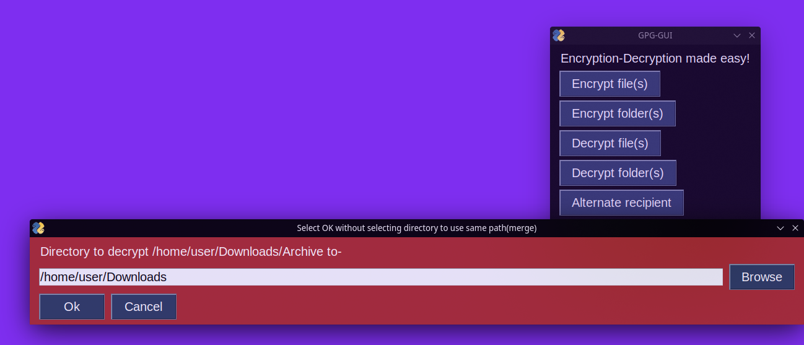

## Simple front-end to GnuPG. Making securing files easy and accessible. Comes with an unstable CLI.

_the source code is available [here](https://github.com/elvindsouza/GPG-GUI)_

---

# Setup and Running

**REQUIRES [GNUPG](https://gnupg.org/) TO BE INSTALLED AND ON $PATH**

`git clone` this repository
`cd` or `dir` into the repository tree root

set up the virtual environment and simply activate it after installing the required packages to run

## Microsoft Windows

```
PS> python -m venv new-venv
PS> new-venv\Scripts\Activate.ps1
(new-venv) PS> python -m pip install -r requirements.txt

```

## Linux

```
$ python -m venv new-venv
$ source new-venv/bin/activate
(new-venv) $ python -m pip install -r requirements.txt
(new-venv) $ source new-venv/bin/activate
```

# Usage

## Encrypting one or more files

Select the first option, and select all the files you want to encrypt in the popup





It will then prompt you for the recipient's e-mail address(public key)

Only the recipient will be able to decrypt this (.gpg) encrypted file

## Encrypting one or more folders

Similar process, but you must select folders and their destinations one at a time







## Decrypting one or more files

Simply select the files you wish to decrpyt, and it will decrypt it based on your identity





_Note-if you have a passphrase, it will ask you for it here_

## Decrypting one or more folders

A similar process follows. Select folders and their destinations for the decrypted versions, and enter passphrase if prompted to do so




